 

  

&nbsp;

 

## About

I'm Dinesh Kumar G, a software developer from an **Information Technology background** with a strong interest in **AI, full-stack development, backend engineering, system design, and computer science fundamentals**.

I enjoy building real applications while going deeper than the framework level: understanding why a technology exists, how it works internally, where it fits, and what trade-offs it introduces.

My goal is simple: become an engineer who can understand a problem deeply, design a good solution, and build it reliably.

---

## Education

### Diploma in Information Technology

My diploma gave me a practical foundation across programming, databases, web development, software engineering, and computing fundamentals.

### Engineering — Lateral Entry

I'm currently continuing my engineering education through **lateral entry**, while strengthening the computer-science fundamentals that support long-term software engineering.

I'm particularly focused on improving my understanding of programming, data structures, algorithms, databases, system design, and software architecture.

---

## Areas I'm Interested In

| Area | What interests me |
|---|---|
| **AI Engineering** | LLM applications, AI-assisted development, intelligent workflows |
| **Software Engineering** | Architecture, clean code, maintainability, reliability |
| **Backend Engineering** | APIs, authentication, databases, queues, caching |
| **System Design** | Scalability, performance, distributed systems, trade-offs |
| **Web Engineering** | Next.js, React, responsive interfaces, interaction design |
| **Computer Science** | Data structures, algorithms, programming fundamentals |
| **Product Development** | Turning ideas into useful, real-world applications |

---

## Technical Skills

### Languages

**TypeScript · JavaScript · Python · C · Java**

### Frontend

**React · Next.js · Tailwind CSS · HTML · CSS · Framer Motion**

### Backend

**Node.js · Express · Fastify · REST APIs · Authentication · Authorization**

### Data & Infrastructure

**PostgreSQL · MongoDB · Redis · Supabase · Docker · Git · GitHub**

### AI & Developer Tools

**OpenAI · Gemini · AI-assisted development · Prompt engineering · VS Code · Figma**

---

## Selected Projects

### DocMorph

AI-powered document transformation platform combining intelligent planning with deterministic document processing.

### Fireworks Platform

Mobile-first enquiry platform built with Next.js, Node.js, PostgreSQL/Supabase, authentication, responsive interfaces, and performance-focused workflows.

### SmartEdu

College management platform combining academic workflows, real-time communication, and AI-assisted learning features.

### ToolBox

Productivity-suite concept bringing frequently used student and everyday utilities into one connected experience.

---

## How I Learn

I learn best by **building and then going underneath the abstraction**.

When I encounter a technology or concept, I try to understand:

**What problem does it solve?**  
**How does it work internally?**  
**When should it be used?**  
**What are the trade-offs?**  
**How would I design a simpler version myself?**

This is especially important to me as I move from framework-focused development toward stronger software-engineering fundamentals.

---

## Currently Learning

- **Data Structures & Algorithms** — strengthening problem-solving fundamentals with C.
- **Advanced TypeScript** — improving type safety, architecture, and maintainability.
- **System Design** — learning how reliable and scalable systems are structured.
- **Backend Engineering** — APIs, authentication, data modelling, queues, caching, and reliability.
- **AI Engineering** — integrating AI where it creates real product value.
- **Performance Engineering** — understanding rendering, networking, database access, and bottlenecks.

---

## Beyond Code

My college journey has also included technical and organizational activities such as IT Association program execution, event hosting, technical knowledge-sharing activities, gaming-event organization, design activities, volunteering, and sports participation.

These experiences have helped me develop communication, coordination, teamwork, and leadership alongside technical skills.

---

## GitHub

  

> **Note:** the statistics above are provided by external services. If GitHub blocks or the services are unavailable, the profile still remains fully functional because the main visual assets are stored inside this repository.

---

## Contribution Activity

The contribution-snake animation is intentionally generated and stored by GitHub Actions rather than depending on a third-party image host.

Once the workflow runs, it will appear here:

---

## Direction

I'm working toward becoming an engineer who can move comfortably across:

**fundamentals → application development → architecture → intelligent systems**

I don't want to collect technologies just for the sake of collecting them.

I want to understand problems, make good engineering decisions, build useful software, and keep improving the depth behind my work.

---

&nbsp;

  

